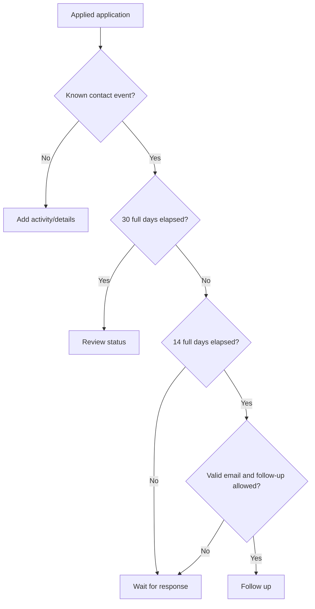

# Application workflow

Status describes the current hiring stage. Events describe what happened.
Next Action and Schedule are calculated from these facts; editing notes or other
metadata never counts as contact or resets response timing.

## Next Action rules

| Status or condition | Next Action |
| --- | --- |
| Draft | Finish application. |
| ToApply | Apply; show the application deadline when known. |
| Applied, no known contact event | Add application activity/details. |
| Applied, fewer than 14 days since latest contact | Wait for response. |
| Applied, 14–29 days, follow-up allowed | Follow up. |
| Applied, 14–29 days, follow-up unavailable | Wait for response. |
| Applied, at least 30 days | Review status. |
| Interviewing, future interview | Prepare interview. |
| Interviewing, past interview | Wait for interview feedback, or review a recruiter reply recorded at/after the interview. |
| Interviewing, no interview time | Add interview details. |
| Assignment, not submitted | Submit assignment if a deadline exists; otherwise add the deadline. |
| Assignment submitted | Wait for assignment feedback. |
| Offer | Respond by the recorded deadline, or review the offer if none exists. |
| Rejected, Ghosted or Withdrawn | No action. |

Waiting and closed states do not count as **Needs attention**. Preparation, missing
details, follow-up, offer response and status review do.

### Response timing

The clock starts at the latest non-future `ApplicationSent`, `FollowUpSent` or
`ContactReceived` event's `OccurredAt`. Each day means a full 24-hour period.
A new follow-up or recruiter reply resets the clock. `UpdatedAt`, notes edits
and status-change events do not. Missing history has no guessed fallback.

At day 30, review replaces follow-up. **Keep active** performs no write and leaves
the review prompt visible. **Mark as ghosted** saves the user's status choice;
time alone never changes status.

### Contact preferences

A valid contact email is required for follow-up suggestions. Neither a contact
name nor an application method establishes a direct contact channel.

| Stored preference | UI label | Follow-up eligibility |
| --- | --- | --- |
| `Unknown` | Default | Eligible with a valid email. |
| `Possible` | Follow-up possible | Still requires a valid email. |
| `NotAvailable` | No direct follow-up channel | Disabled. |
| `NotNeeded` | Do not suggest follow-up | Disabled. |

Selecting Possible without an email is allowed but does not enable suggestions.
Email format is validated in both web and API; this does not check deliverability.
Contact person is limited to 200 characters and email to 254. Empty contact fields
persist as null.

Application methods are `Unknown`, `CompanyPortal`, `Email`,
`RecruiterDirect`, `LinkedInEasyApply` and `Other`. Both method and follow-up
preference default to Unknown.

## Recording activity

`POST /api/applications/{id}/events` returns 201 with the updated application and
its events. The parent application must belong to the signed-in user.

| Event | How it is created / effect |
| --- | --- |
| ApplicationCreated | Automatic on application creation. |
| StatusChanged | Automatic when an existing application's status changes. |
| ApplicationSent | Record activity sets Applied and AppliedDate; editing AppliedDate also synchronizes the sent fact. |
| FollowUpSent | Record activity while Applied; preserves status. |
| ContactReceived | Record activity; preserves status. |
| InterviewScheduled | Record activity; sets Interviewing. |
| AssignmentReceived | Record activity; sets Assignment. |
| AssignmentSubmitted | Record activity while Assignment; preserves status. |
| OfferReceived | Record activity; sets Offer. |

Automatic event types cannot be posted directly. Creating an application in a
later status does not invent the earlier stages. Events and any resulting status
change are saved in one transaction.

| Event field | Meaning |
| --- | --- |
| `OccurredAt` | When the activity happened; required, past or present. |
| `DueAt` | Actual interview time or assignment/offer deadline. Required for interviews, optional for assignments/offers, unavailable for other types. |
| `CreatedAt` | Server timestamp when the event was recorded. |
| `Note` | Optional text, at most 4000 characters. |
| `FromStatus`, `ToStatus` | Previous/new statuses on automatic status-change events. |

DueAt cannot precede OccurredAt. Inputs use local time and are stored as UTC.
For an interview, OccurredAt is when it was arranged and DueAt is when it takes
place. Invalid input returns 400; missing/foreign applications return 404;
unauthenticated requests return 401.

Timeline and API responses order events by occurrence time descending, then
recording time descending, then ID ascending. There is no separate events GET
endpoint: application responses include history.

## Applied date corrections

There is at most one ApplicationSent event. An AppliedDate entered on creation
produces that fact; recording ApplicationSent explicitly sets the date. A second
explicit ApplicationSent request is rejected.

Editing AppliedDate corrects the existing sent event and preserves its ID.
Clearing the date removes that event; other history remains. Date-only values
use midnight UTC. An explicitly recorded sending time survives until the date is
changed. Synchronizing the date through Edit does not itself change status.

This is editable history. There is no general event-edit/delete interface or
immutable audit log.

## Stage history

For interviews, assignments and offers, the latest relevant occurrence in the
current stage wins; recording time breaks ties. Stage entry is identified from
the latest recorded StatusChanged event into the current status. Events recorded
before that entry are historical and do not reactivate old reminders.

A new InterviewScheduled, AssignmentReceived or OfferReceived event can replace
the current stage date while retaining older history. AssignmentSubmitted removes
the submission reminder when it is the current stage event.

## Schedule rules

| Category | Source and lifetime |
| --- | --- |
| Hard date: application deadline | `Deadline`, only while Draft or ToApply. |
| Hard date: interview | Current stage's interview time; removed once the time is reached. |
| Hard date: assignment | Current unsubmitted assignment's deadline. |
| Hard date: offer | Current offer's response deadline. |
| Suggested attention | Follow-up at contact +14 days if eligible, otherwise status review at +30 days. Review replaces follow-up at day 30. |

Suggestions may appear ahead of their date; Next Action becomes actionable at the
threshold. There is at most one response suggestion per Applied application.
A newer contact event replaces its timing. Missing dates create no invented
commitment, and closed applications generate no Schedule entries.

Hard dates use the browser's local calendar day for overdue/today/upcoming groups.
Date-only application deadlines keep the entered day. Suggested attention is shown
separately, not as an overdue deadline. Dashboard's Schedule counts cover hard
dates only.

There is no reminder table, completion endpoint, stored snooze, interview
completion action or accepted-offer status.

## Implementation references

- [Next Action](../web/src/features/applications/utils/applicationNextAction.ts)
- [Contact and stage selection](../web/src/features/applications/utils/applicationActivity.ts)
- [Schedule and Timeline](../web/src/features/applications/utils/applicationWorkflow.ts)
- [API activity endpoint](../api/JobTracker.Api/Controllers/ApplicationEventsController.cs)
- [Applied date/status synchronization](../api/JobTracker.Api/Services/ApplicationWorkflow.cs)

See [database migrations](database-migrations.md) for schema history and
[current verification](current-feature.md#verification) for test coverage and
remaining browser checks.
