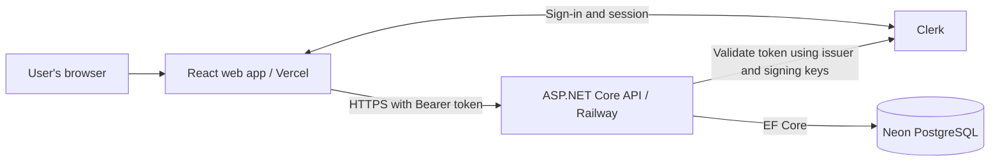
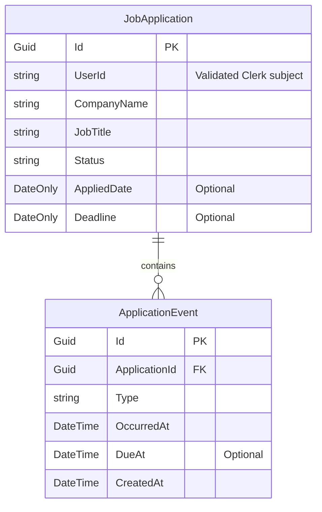
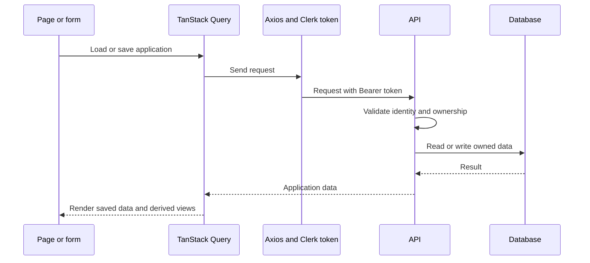

# Architecture

JobTracker is a React web app backed by an authenticated ASP.NET Core API.
The API owns persistence and access control. The frontend derives Next Action,
Schedule and summaries from saved applications and events.

## System overview

This is the deployed web architecture. Local development uses Vite, the same API
and SQLite. There is no mobile client yet.

| Layer | Current implementation |
| --- | --- |
| Web | React, TypeScript, Vite, MUI and React Router. |
| API access | Feature-level Axios modules and TanStack Query. |
| Forms | React state and shared validation helpers. React Hook Form and Zod are not installed. |
| API | .NET 10, controllers, request/response DTOs and EF Core 10. |
| Authentication | Clerk on the web; JWT Bearer validation in the API. |
| Database | Neon PostgreSQL in production; SQLite by default locally. |
| Tests | Vitest and React Testing Library; xUnit and WebApplicationFactory. |

## Data and ownership

The diagram shows the core relationship, not every field. Applications also store
listing details, contact preferences, notes, description and technical timestamps.
Events may include a note and previous/new statuses. Deleting an application
cascades to its events. Both models generate GUIDs in C#.

There is no local Users table, separate Contact table or persisted Reminder model.
An event inherits ownership through its parent application.

The API validates the token signature, issuer and lifetime, plus audience when
configured. A supplied `azp` must match an allowed frontend origin. Missing
subjects and pending Clerk sessions are rejected. The validated `sub` becomes
`UserId`; clients cannot choose it through DTOs. Missing authentication returns
401, and another user's application ID returns 404.

Legacy `dev-user` rows remain untouched. They are never assigned to a Clerk user
automatically.

## Frontend data flow

`ApplicationsProvider` shares the list with Applications, Dashboard, Schedule and
Insights. Details uses its own query. Keys are `["applications"]` and
`["applications", id]`.

Create refreshes the list. Update and event creation update the list/detail cache
and invalidate queries. Delete removes the cached record and refreshes the list.
Pending reads are canceled where needed to avoid overwriting successful writes.

Each Clerk user/session pair has its own QueryClient. Signing out or switching
identity unmounts the workspace, cancels reads and clears caches. Late responses
cannot populate a different user's cache.

Queries have a 30-second freshness window, not a polling interval. Requests have
no automatic retries; the UI offers recovery actions and preserves failed form
submissions. Axios uses a 15-second timeout. An API 401 clears the workspace and
offers reauthentication; a 403 is shown as a permission error. The app never
falls back to mock data after an API failure.

## API surface

All six endpoints require authentication.

| Method | Path | Success |
| --- | --- | --- |
| GET | `/api/applications` | 200, owned applications with events. |
| GET | `/api/applications/{id}` | 200, one owned application. |
| POST | `/api/applications` | 201, created application. |
| PUT | `/api/applications/{id}` | 200, updated application. |
| DELETE | `/api/applications/{id}` | 204, application and events removed. |
| POST | `/api/applications/{id}/events` | 201, updated application with events. |

PUT replaces editable fields; omitted optional text/date fields become null, and
omitted method/preference fields default to Unknown. Invalid input returns 400.
Enums are strings; numeric and undefined enum values are rejected.

Search, filters, sorting, Next Action and summaries run in the frontend over the
loaded list. There are no dashboard, reminder or search-specific API endpoints.
See [API examples](../api/README.md#endpoints) and [workflow rules](application-workflow.md).

## Deployment architecture

Deployment was confirmed by the project owner on 2026-10-05. This describes the
repository's deployment configuration; live hosting settings and production
behavior were not independently rechecked during the documentation review.

| Service | Role and settings |
| --- | --- |
| Vercel | Web project directory `web/`; build with `npm run build`, output `dist/`. `web/vercel.json` rewrites deep links to `index.html`. |
| Railway | ASP.NET Core API with environment configuration below. |
| Neon | PostgreSQL database using the PostgreSQL EF migration series. |
| Clerk | Frontend session and matching API token issuer configuration. |

| Variable | Where | Purpose |
| --- | --- | --- |
| `VITE_API_BASE_URL` | Web build | API origin, without `/api`. |
| `VITE_CLERK_PUBLISHABLE_KEY` | Web build | Publishable key for the intended Clerk instance. |
| `DatabaseProvider` | API | `Postgres` or `PostgreSQL` in production; `Sqlite` locally. |
| `ConnectionStrings__DefaultConnection` | API | Connection string for that provider. |
| `FrontendUrl` | API | Deployed frontend origin allowed by CORS. |
| `Clerk__Authority` | API | Clerk Frontend API URL / token issuer, matching the web key's instance. |
| `Clerk__AuthorizedParties__0` | API | Exact allowed frontend origin; use further array indexes for additional origins. |
| `Clerk__Audience` | API, optional | Set only when the actual tokens have that audience. |

Frontend variables are read at build time; rebuild after changing them. Never put
a Clerk secret key or database credentials in a `VITE_` variable.

API environment values override JSON configuration. Local Clerk settings can live
in ignored `api/JobTracker.Api/appsettings.Development.json`. CORS runs in all
environments and permits `FrontendUrl` plus both localhost/127.0.0.1 port-5173
origins. CORS and Clerk authorized parties are separate checks. Swagger is enabled
only in Development.

Database migrations are explicit, not run at startup. SQLite and PostgreSQL have
separate context types and migration histories over one model; see
[database migrations](database-migrations.md).

## Code map

| Location | Responsibility |
| --- | --- |
| `web/src/app/` | Router, theme and application providers. |
| `web/src/features/auth/` | Authentication boundary and session isolation. |
| `web/src/features/applications/` | Forms, pages, API calls, types and workflow calculations. |
| `web/src/lib/apiClient.ts` | Shared HTTP client and token handling. |
| `api/JobTracker.Api/Controllers/` | Owned REST operations. |
| `api/JobTracker.Api/DTOs/` | API contracts and validation. |
| `api/JobTracker.Api/Services/` | Current user and workflow event helpers. |
| `api/JobTracker.Api/Data/` | EF contexts and shared model configuration. |
| `api/JobTracker.Api/Migrations/` | Separate SQLite and PostgreSQL migration series. |

The mock application/storage helpers still exist but are not part of the runtime
data flow. Mobile remains a future possibility using the same API and ownership
model; it is not part of the deployed system.
