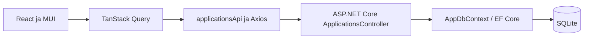

# Miten JobTracker toimii nyt

Tämä dokumentti kuvaa toteutusta 16.9.2026. Tulevaisuuden suunnitelmat löytyvät
[roadmapista](roadmap.md) ja [arkkitehtuurisuunnitelmasta](architecture.md).

## Kokonaisuus

JobTrackerilla voi tallentaa työpaikkahakemuksia, muokata niiden tietoja ja seurata
hakuprosessien tilannetta. React-käyttöliittymä käyttää ASP.NET Core API:a, joka
tallentaa hakemukset SQLite-tietokantaan Entity Framework Coren avulla.



Hakemusten pysyvä tietolähde on tietokanta. TanStack Query pitää API:n vastauksia
selaimen muistissa. Sivun uudelleenlataus hakee tiedot API:sta uudelleen.
Teemavalinta säilytetään selaimen localStoragessa.

Kirjautumista ei vielä ole. API käyttää kaikille pyynnöille samaa `dev-user`-käyttäjää.
`UserId` valmistaa tietomallia myöhempään käyttäjäkohtaiseen käyttöön, mutta nykyinen
toteutus ei tunnista käyttäjiä.

## Sivut

| Sivu | Osoite | Toiminta |
| --- | --- | --- |
| Dashboard | `/dashboard` | Hakemusten yhteenveto, tilajakauma, seuraavat toimet ja muistutusten yhteenveto. |
| Applications | `/applications` | Hakemuslista, lisääminen, haku, suodatus ja järjestäminen. |
| Application Details | `/applications/:id` | Hakemuksen tiedot, muokkaus, poistaminen ja Timeline-esikatselu. |
| Schedule | `/schedule` | Hakemuksista muodostetut muistutukset ja aktiiviset haastattelu-, tehtävä- ja tarjousvaiheet. |
| Insights | `/insights` | Hakemuksista lasketut tilastot, kuten tilajakauma ja tietojen kattavuus. |
| Settings | `/settings` | Teeman valinta sekä myöhempien asetusten esikatselu. |

Etusivu `/` ohjaa Dashboardiin. Sivupalkista voi vaihtaa sivua.

## Hakemuksen käsittely

1. Avaa Applications ja valitse **Add Application**.
2. Täytä vähintään yritys ja tehtävänimike. Muut tiedot ovat valinnaisia.
3. Tallenna. Selain lähettää POST-pyynnön, ja API palauttaa tallennetun hakemuksen.
   Lomake sulkeutuu onnistumisen jälkeen ja listan suodattimet tyhjennetään.
4. Avaa hakemus listalta nähdäksesi sen tiedot. Muokkaus tallentaa muutokset PUT-pyynnöllä.
5. Poistaminen pyytää vahvistuksen ja lähettää DELETE-pyynnön. Onnistunut poisto
   palauttaa hakemuslistaan. Poisto poistaa tietueen tietokannasta.

Tallennuksen aikana lomakkeen toiminnot estävät päällekkäiset lähetykset.
Epäonnistunut tallennus näyttää virheen ja säilyttää syötetyt tiedot.
Poiston epäonnistuessa vahvistusikkuna jää auki ja näyttää virheen.

### Haku, suodatus ja järjestäminen

Toiminnot käsittelevät selaimeen haettua listaa. Niille ei ole omia API-pyyntöjä.

- Haku kohdistuu yrityksen nimeen ja tehtävänimikkeeseen, kirjainkoosta riippumatta.
- Tilasuodatin valitsee yhden hakemuksen tilan.
- **Active** sisältää muut kuin `Rejected`, `Ghosted` ja `Withdrawn`.
- **Archived** sisältää nämä kolme suljettua tilaa. Arkistointi on tässä suodatus, ei erillinen tietokantatoiminto.
- **Needs follow-up** käyttää Next Action -laskentaa.
- Järjestysvaihtoehdot ovat viimeksi päivitetty, hakupäivä ja lähin määräpäivä.
  Puuttuvat määräpäivät sijoitetaan viimeiseksi. Tasatilanteet järjestetään yrityksen ja tehtävänimikkeen perusteella.

Dashboardin **active processes** -mittari laskee vain tilat `Applied`,
`Interviewing`, `Assignment` ja `Offer`. Sen määritelmä on suppeampi kuin
Applications-listan Active-suodatin, johon myös luonnokset kuuluvat.

## Next Action

Selain päättelee seuraavan toimen hakemuksen tilasta ja viimeisestä päivityksestä.
API ei tallenna Next Action -arvoa eikä muuta tilaa automaattisesti.

| Tila | Ehdotettu toiminto |
| --- | --- |
| `Draft` | Finish application |
| `ToApply` | Apply |
| `Applied`, alle 14 päivää viimeisestä toiminnasta | Wait for response |
| `Applied`, vähintään 14 mutta alle 30 päivää | Follow up |
| `Applied`, vähintään 30 päivää | Consider ghosted |
| `Interviewing` | Prepare interview |
| `Assignment` | Submit assignment |
| `Offer` | Respond to offer |
| `Rejected`, `Ghosted`, `Withdrawn` | No action |

Aika lasketaan ensisijaisesti `updatedAt`-kentästä kokonaisina 24 tunnin jaksoina.
Varavaihtoehdot ovat `appliedDate` ja `createdAt`. API:n hakemuksilla `updatedAt`
on aina olemassa, joten myös esimerkiksi muistiinpanon muokkaus aloittaa odotusajan
uudelleen. Vähintään 30 päivän kohdalla hakemus kuuluu sekä follow-up- että
ghosted risk -ryhmään. Käyttäjä päättää itse, muuttaako tilaksi `Ghosted`.

## Timeline, Schedule ja Insights

Timeline muodostetaan nykyisen hakemuksen luontiajasta, hakupäivästä, tilasta ja
päivitysajasta. Se ei ole tallennettu muutoshistoria: aiempia tilasiirtymiä ei
säilytetä erillisinä tapahtumina.

Schedule muodostaa muistutukset selaimessa:

- Follow-up: viimeinen päivitys + 14 päivää, kun Next Action edellyttää follow-upia.
- Haastatteluun valmistautuminen: määräpäivä tai viimeinen päivitys + 2 päivää.
- Tehtävän palautus: määräpäivä tai viimeinen päivitys + 3 päivää.
- Tarjoukseen vastaaminen: määräpäivä tai viimeinen päivitys + 2 päivää.
- Hakemuksen määräpäivä: erillinen muistutus, jos samalle päivälle ei jo muodostunut muistutusta.

Muistutukset ryhmitellään myöhästyneisiin, tämän päivän ja tuleviin.
Niitä ei tallenneta erilliseen tauluun, eikä niillä ole pysyvää kuittausta tai
taustalla toimivaa ilmoitusten lähettämistä.

Dashboard ja Insights laskevat yhteenvetonsa samasta API:sta haetusta listasta.
Niille ei ole erillisiä backend-endpointteja. Settingsin profiili-, vienti- ja
seuranta-asetukset ovat vielä esikatselua. Teemavalinta toimii ja säilyy selaimessa.
Näkyvät 14/30 päivän seurantarajat eivät ole muokattavia asetuksia.

## API ja tietomalli

API käyttää controllereita. `AppDbContext` käsittelee `JobApplications`-taulua,
ja EF Core -migraatiot määrittävät tietokannan rakenteen.

| Kentät | Merkitys |
| --- | --- |
| `id` | API:n luoma GUID-tunniste. |
| `UserId` | Sisäinen omistajakenttä, nyt `dev-user`; ei mukana vastaus-DTO:ssa. |
| `companyName`, `jobTitle` | Pakollinen yritys ja tehtävänimike; pelkkä tyhjä tila ei kelpaa. |
| `jobUrl`, `location`, `source` | Valinnaiset ilmoituksen osoite, sijainti ja lähde. |
| `status` | Yksi Next Action -taulukon yhdeksästä tilasta; oletus `Draft`. |
| `appliedDate`, `deadline` | Valinnaiset päivämäärät muodossa `YYYY-MM-DD`. |
| `salaryRange`, `notes`, `jobDescription` | Valinnaiset tekstikentät. |
| `createdAt`, `updatedAt` | API:n asettamat UTC-aikaleimat. |

Status kulkee JSONissa merkkijonona ja tallentuu tietokantaan tekstinä.
Luonnissa molemmat aikaleimat saavat saman arvon. Muokkauksessa vain `updatedAt`
muuttuu. Tyhjät valinnaiset lomakekentät muunnetaan lähetettäessä `null`-arvoiksi.

DTO tarkoittaa API:n sisään tai ulos kulkevan tiedon muotoa. Controller vastaanottaa
`CreateJobApplicationRequest`- tai `UpdateJobApplicationRequest`-olion ja palauttaa
`JobApplicationResponse`-olion. Tietokannan `JobApplication`-entiteetti on erillinen.
Näin selain lähettää vain muokattavat kentät eikä määrää omistajaa, tunnistetta tai aikaleimoja.

| Metodi ja polku | Onnistuminen | Tavallinen virhe |
| --- | --- | --- |
| `GET /api/applications` | `200`, lista; tyhjässä tietokannassa `[]` | |
| `GET /api/applications/{id}` | `200`, hakemus | `404`, ei löydy |
| `POST /api/applications` | `201`, hakemus ja Location-otsake | `400`, virheellinen syöte |
| `PUT /api/applications/{id}` | `200`, päivitetty hakemus | `400` tai `404` |
| `DELETE /api/applications/{id}` | `204`, ei vastausrunkoa | `404` |

PUT korvaa muokattavat kentät; pois jätetty valinnainen kenttä muuttuu `null`-arvoksi.
Kaikki haut rajataan `dev-user`-omistajaan. Esimerkkipyyntö löytyy [API-ohjeesta](../api/README.md).

## Frontendin datavirta ja virhetilanteet

`ApplicationsProvider` jakaa listakyselyn Applications-, Dashboard-, Schedule- ja
Insights-sivuille. Details hakee yhden hakemuksen omalla kyselyllään.

| Query key | Käyttö |
| --- | --- |
| `["applications"]` | Hakemuslista ja siitä lasketut yhteenvedot. |
| `["applications", id]` | Yksittäisen hakemuksen tiedot. |

Lisäys päivittää listan. Muokkaus vie API:n palauttaman hakemuksen listan ja Detailsin
välimuisteihin ja käynnistää niiden uudelleenvalidoinnin. Poisto poistaa hakemuksen
välimuistista ja päivittää listan. Keskeneräiset haut perutaan tarvittaessa, jotta
vanha vastaus ei korvaa juuri tallennettua tietoa.

Kyselyiden `staleTime` on 30 sekuntia: sen ajan tieto katsotaan tuoreeksi. Tämä ei
tarkoita 30 sekunnin välein tapahtuvaa taustapollausta. Epäonnistumisia ei yritetä
automaattisesti uudelleen; käyttöliittymä tarjoaa uudelleenyrityksen.

Lataukselle, epäonnistuneelle haulle, tyhjälle listalle ja puuttuvalle hakemukselle
on omat näkymänsä. API-virhe ei vaihda tietolähteeksi mock-dataa.
Axios-asiakas käyttää 15 sekunnin aikakatkaisua ja `VITE_API_BASE_URL`-asetusta.

Aiemmin hakemukset alustettiin localStoragesta tai mock-datasta, ja muutokset
tallennettiin selaimeen. `mockApplications.ts`, `applicationStorage.ts` ja
`applicationCrud.ts` ovat yhä vanhana koodina mukana, mutta nykyinen provider ei
käytä niitä. Vanhoja localStorage-hakemuksia ei tuoda automaattisesti tietokantaan.

## Paikallinen käynnistys

Tarvitset .NET 10 SDK:n sekä Node.js:n ja npm:n, jotka tukevat projektin riippuvuuksia.
Aja komennot PowerShellissä. Kumpikin terminaali aloittaa projektin juuresta.

Ensimmäinen terminaali, API:

```powershell
cd api/JobTracker.Api
dotnet tool restore
dotnet ef database update
dotnet run
```

Migraatio luo paikallisen `jobtracker.db`-tietokannan. Migraatioita ei ajeta
automaattisesti käynnistyksessä, eikä tietokantaan lisätä esimerkkihakemuksia.
Aja API tästä hakemistosta, jotta suhteellinen tietokantapolku pysyy samana.

Toinen terminaali, frontend:

```powershell
cd web
npm install
if (-not (Test-Path .env.local)) { Copy-Item .env.example .env.local }
npm run dev -- --host 127.0.0.1 --port 5173 --strictPort
```

Tarkista, että `web/.env.local` sisältää:

```dotenv
VITE_API_BASE_URL=http://localhost:5080
```

Osoitteeseen ei lisätä `/api`-osaa. Käynnistä Vite uudelleen ympäristömuuttujan muuttamisen jälkeen.

- Käyttöliittymä: [127.0.0.1:5173](http://127.0.0.1:5173)
- Swagger: [localhost:5080/swagger](http://localhost:5080/swagger)
- OpenAPI: [localhost:5080/swagger/v1/swagger.json](http://localhost:5080/swagger/v1/swagger.json)

Development-tilassa CORS sallii frontendin osoitteista `http://localhost:5173` ja
`http://127.0.0.1:5173`. Muu portti vaatii CORS-asetuksen muuttamisen.
Jos hakemukset eivät lataudu, tarkista API:n käynnistys, migraatiot, ympäristömuuttuja
ja frontendin portti. Tyhjä lista ensimmäisellä käynnistyksellä on normaali.

## Miten testit ajetaan?

Automatisoituja testejä varten kehityspalvelimien ei tarvitse olla käynnissä.
Seuraavat komentolohkot aloittavat projektin juuresta omissa terminaaleissaan.

Backend:

```powershell
cd api
dotnet test
dotnet build
```

`dotnet test` käyttää `JobTracker.sln`-ratkaisua. xUnit ja WebApplicationFactory
testaavat CRUD-pyyntöjä, validointia, aikaleimoja, tilojen tekstimuotoa ja omistajarajausta.
Jokaisella testillä on oma muistissa oleva SQLite-tietokanta, johon ajetaan oikeat
migraatiot. Testit eivät käytä tavallista kehitystietokantaa.

Frontend:

```powershell
cd web
npm run test
npm run build
npm run lint
```

`npm run test` ajaa Vitest-testit kerran. Jatkuva tila, jossa testit ajetaan uudelleen
tiedostojen muuttuessa (aja edelleen `web`-hakemistossa):

```powershell
npx vitest
```

Frontend-testit kattavat Next Action -säännöt ja aikarajat, listan suodatuksen ja
järjestämisen, lomakkeiden tietomuunnokset sekä valitut lataus-, virhe-, tyhjä lista-,
lisäys- ja puuttuvan hakemuksen tilanteet. React Testing Library -testeissä käytetään
oikeaa provideriä ja QueryClientiä, mutta HTTP-liikenne korvataan testivastauksilla.

Testikerros ei kata kaikkia käyttöliittymäpolkuja: esimerkiksi muokkauksen ja poiston
frontend-vuorovaikutus, teeman säilyminen sekä kaikkien yhteenvetosivujen näkymät
vaativat vielä manuaalista tarkistusta. MUI:n sisäistä toteutusta ei testata.

Erillinen `api/scripts/Test-Applications.ps1` on käynnissä olevaa API:a käyttävä
HTTP-tarkistus. Toisin kuin xUnit-testit, se luo ja poistaa testihakemuksen API:n
käyttämässä tietokannassa. Ohje on [API-dokumentaatiossa](../api/README.md#verification).

## Keskeiset lähdekoodit

- [API-asiakas](../web/src/lib/apiClient.ts): osoite, aikakatkaisu ja virheiden käsittely.
- [Applications API -kutsut](../web/src/features/applications/api/applicationsApi.ts): viisi HTTP-operaatiota.
- [Next Action](../web/src/features/applications/utils/applicationNextAction.ts): seuraavan toimen säännöt.
- [Listan käsittely](../web/src/features/applications/utils/applicationList.ts): haku, suodatus ja järjestys.
- [Timeline ja muistutukset](../web/src/features/applications/utils/applicationWorkflow.ts): johdetut esikatselut.
- [API:n käynnistys](../api/JobTracker.Api/Program.cs): palvelut, tietokanta, CORS ja Swagger.

Clerk-kirjautuminen, erikseen tallennettava Timeline ja muistutukset, tuotannon
PostgreSQL, julkaisu ja mobiilisovellus ovat tulevaa työtä.
