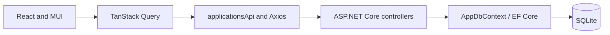

# How JobTracker works

This document describes the implementation as of 2026-10-02. See the
[roadmap](roadmap.md) and [architecture](architecture.md) for future plans, and
[the current feature](current-feature.md) for acceptance criteria.

## Overview

JobTracker stores job applications and helps users track each hiring process.
The React web app calls an ASP.NET Core API, which persists applications and
workflow events in local SQLite through Entity Framework Core.



The database is the persistent source of application data. TanStack Query caches
API responses in browser memory; reloading fetches them again. Next Action,
Schedule, Dashboard, Insights and list filters are frontend calculations over
that data. Theme preference is stored in localStorage.

Clerk handles sign-in. The workspace and its API requests start only after an
authenticated session is ready. The sidebar shows the user's profile and sign-out
control. Theme state stays mounted across sign-in and sign-out.

Axios requests a current Clerk session token for each API call and sends it as a
Bearer token. The app does not persist tokens itself. The API validates the
signature, issuer, lifetime and permitted `azp` origin. It validates audience when
configured. `CurrentUser` reads the validated `sub` claim, and all application
queries are scoped to that owner.

## Pages

| Page | Route | Purpose |
| --- | --- | --- |
| Dashboard | `/dashboard` | Application counts, pipeline status, next actions and a Schedule summary. |
| Applications | `/applications` | Create applications, search, filter and sort the list. |
| Application Details | `/applications/:id` | View, edit or delete an application; record activity and read its Timeline. |
| Schedule | `/schedule` | Recorded commitments and a separate Suggested attention section. |
| Insights | `/insights` | Frontend summaries of status, activity and data coverage. |
| Settings | `/settings` | Working theme controls and previews of future settings. |

The root route `/` redirects to Dashboard. Sidebar links navigate between pages.

## Managing applications

1. Open Applications and choose **Add Application**.
2. Enter a company and job title. Other fields are optional, including application
   method, contact information and follow-up preference.
3. Save. The browser sends a POST request and receives the saved application.
   On success, the form closes, the list refreshes and its filters reset.
4. Open an application for Details. **Edit** saves changes through PUT.
5. **Delete** asks for confirmation, then sends DELETE. Successful deletion removes
   the application and its events from the database and returns to the list.

Forms disable saving controls while a request is pending. A failed save displays
an error and keeps the entered values. A failed deletion keeps the confirmation
open so the user can retry.

### Add and Edit form layout

Both dialogs use the same form, with four sections:

- **Basic Info:** Company, Job title, Job URL and Location.
- **Tracking:** Status, Applied date when relevant, Application deadline, Source and Salary range.
- **Application & Contact:** Application method, Follow-up preference, Contact person and Contact email.
- **Details:** Job description first, followed by Notes.

The visible **Application deadline** label still maps to the API's `deadline` field.
An empty Applied date is hidden for Draft and ToApply, and shown for Applied,
Interviewing, Assignment, Offer, Rejected, Ghosted and Withdrawn. A date already
present stays visible in Add or Edit, including after switching back to Draft or
ToApply. Changing status never fills or clears the date. Explicit date corrections
continue to use the existing ApplicationSent synchronization described below.

Job description is a full-width, expanding field with eight initial rows for a
pasted advertisement. Notes starts with three rows and is for personal observations.
**Clean formatting** normalizes line endings, removes trailing spaces and reduces
excessive blank lines to one blank line between paragraphs. It preserves wording,
bullets and indentation, uses no AI or dependencies, and only changes the unsaved
description. **Undo formatting** restores the pre-cleanup value; manually editing
the description dismisses that undo option. Cleanup never changes Notes.

Fields stack on small screens. The dialog content scrolls while footer actions
remain outside the scroll area. No document uploads or Cover Letter fields are added.

### Application method and contact preferences

| Field | Values or purpose |
| --- | --- |
| `applicationMethod` | `Unknown`, `CompanyPortal`, `Email`, `RecruiterDirect`, `LinkedInEasyApply`, `Other`. Defaults to `Unknown`. |
| `followUpMode` | `Unknown`, `Possible`, `NotAvailable`, `NotNeeded`. Defaults to `Unknown`. |
| `contactPerson` | Optional name, maximum 200 characters. |
| `contactEmail` | Optional direct email address, maximum 254 characters. |

Display labels retain their existing API values:

| Application method value | Display label |
| --- | --- |
| `Unknown` | Not specified |
| `CompanyPortal` | Company portal |
| `Email` | Email |
| `RecruiterDirect` | Direct recruiter contact |
| `LinkedInEasyApply` | LinkedIn Easy Apply |
| `Other` | Other |

| Follow-up mode value | Display label |
| --- | --- |
| `Unknown` | Default |
| `Possible` | Follow-up possible |
| `NotAvailable` | No direct follow-up channel |
| `NotNeeded` | Do not suggest follow-up |

Helper text explains the direct-email requirement and when suggestions are disabled.
Selecting Follow-up possible without an email is still allowed; it does not make
the application eligible for follow-up. Contact validation and eligibility are unchanged.

Both the frontend and API validate contact email format: a non-whitespace local
part, `@`, and a dotted domain. This checks format, not whether the address exists.
Empty contact fields are stored as null.

A follow-up suggestion requires a valid contact email and a preference other than
`NotAvailable` or `NotNeeded`. `Possible` still requires an email. `Unknown` with
an explicitly entered valid email allows suggestions; legacy records without a
contact email do not. An application method or contact name never creates a contact
channel. Portal and LinkedIn Easy Apply applications without one are monitored
without a day-14 follow-up.

### Search, filters and sorting

These operations use the list already loaded into the browser; they do not make
separate API requests.

- Search matches company or job title, ignoring case and surrounding whitespace.
- The status filter selects one of the nine stored application statuses.
- **Active** includes all statuses except `Rejected`, `Ghosted` and `Withdrawn`,
  including Draft and ToApply.
- **Archived** includes those three closed statuses. It is a list filter, not a
  separate archive operation in the database.
- **Needs attention** includes actions the user can take now: preparation, missing
  details, eligible follow-up, offer review and status review. Waiting and closed
  applications are excluded.
- Sorting supports recently updated, applied date and nearest application deadline.
  Missing deadlines sort last; company and job title break ties.

Dashboard's **Active hiring processes** metric counts only `Applied`,
`Interviewing`, `Assignment` and `Offer`. It therefore has a narrower definition
than the Applications Active filter.

## Next Action

Stored status describes the process. Next Action is a derived suggestion based on
that status, communication history and recorded dates. The API does not store Next
Action, and its calculation never changes status.

| State or condition | Suggested action | Needs attention |
| --- | --- | --- |
| Draft | Finish application | Yes |
| ToApply | Apply | Yes |
| Applied, fewer than 14 full days since the response anchor | Wait for response | No |
| Applied, 14 to fewer than 30 days, contactable and follow-up allowed | Follow up | Yes |
| Applied, 14 to fewer than 30 days, follow-up unavailable, unneeded or contact unknown | Wait for response | No |
| Applied, at least 30 days | Review status | Yes |
| Applied, no response anchor | Add application activity/details | Yes |
| Interviewing, future interview | Prepare interview | Yes |
| Interviewing, interview time reached or passed without a resolving reply | Wait for interview feedback | No |
| Interviewing, recruiter reply after the interview | Review recruiter reply | Yes |
| Interviewing, missing interview time | Add interview details | Yes |
| Assignment, not submitted and deadline known | Submit assignment | Yes |
| Assignment, not submitted and deadline missing | Add assignment deadline | Yes |
| Assignment submitted | Wait for assignment feedback | No |
| Offer, response deadline known | Respond to offer | Yes |
| Offer, response deadline missing | Review offer | Yes |
| Rejected, Ghosted or Withdrawn | No action | No |

The response anchor is the latest non-future `ApplicationSent`, `FollowUpSent` or
`ContactReceived` event by `OccurredAt`. Thresholds use full 24-hour periods. Exactly
14 days starts the middle band; exactly 30 days makes Review status take precedence
regardless of contactability. A follow-up or recruiter reply resets the clock.
Notes edits, other unrelated events and `updatedAt` do not reset it. Missing history
never falls back to a guessed date.

**Review status** offers two choices:

- **Keep active** leaves the application unchanged and explains that the review
  prompt remains. It does not snooze the prompt or create communication history.
- **Mark as ghosted** saves the user's status choice through the normal authorized
  application update flow. Elapsed time never causes this transition automatically.

Within a workflow stage, the latest relevant event determines the current interview,
assignment or offer details. Leaving and re-entering a stage does not reactivate its
older events. See the [workflow rules](application-workflow.md) for ordering details.

## Timeline and recorded activity

Timeline displays persisted events from newest to oldest. **Record activity** can
record an application sent, follow-up sent, recruiter reply, interview scheduled,
assignment received or submitted, and offer received. Status changes create events
automatically. Ordinary text edits do not create activity events.

**Activity occurred at** records when the activity happened. Interview time and
assignment/offer deadlines are separate inputs. Inputs use local time and are
saved as UTC. OccurredAt is required and cannot be in the future. DueAt cannot
precede it; interviews require DueAt, while assignments and offers may omit it.
Other event types do not accept DueAt.

ApplicationSent, InterviewScheduled, AssignmentReceived and OfferReceived set the
corresponding workflow status. FollowUpSent is accepted while Applied, and
AssignmentSubmitted while Assignment. **ContactReceived preserves status** and
records the actual reply time. Event creation and any status change save together.

There is one ApplicationSent event per application. Editing Applied date corrects
that event; clearing the date removes it. Other events remain intact. Date-only
AppliedDate values use midnight UTC; explicit sent times remain unchanged unless
the date is corrected. This is editable history, not an immutable audit log.

## Schedule, Dashboard and Insights

Schedule separates two categories:

| Category | Source | Behavior |
| --- | --- | --- |
| Hard date | Future interview time | Shows the recorded time; leaves the queue when that time is reached. |
| Hard date | Unsubmitted assignment deadline | Shows the latest recorded deadline; submission removes the entry. |
| Hard date | Offer response deadline | Shows the recorded response deadline while in Offer. |
| Hard date | Application deadline | Shown while Draft or ToApply; later stages do not reuse it as their deadline. |
| Suggested attention | Eligible follow-up | Suggested from response anchor +14 days. |
| Suggested attention | Status review | Suggested from response anchor +30 days. At day 30 it replaces the follow-up. |

Hard dates are grouped as overdue, today and upcoming using the browser's local
calendar. Date-only application deadlines retain their entered day. Suggested
attention appears in its own section and is not presented as an overdue deadline.
Each entry links to its application.

There is at most one response suggestion per Applied application. A contactable
application shows its follow-up date until day 30, then its review date. An
uncontactable portal application shows the review date without a follow-up entry.
New communication replaces the old suggestion using the new anchor. Missing dates
are never invented. Closed applications generate no entries in either category.

Reminders remain frontend-derived: there is no reminder table, completion endpoint
or stored snooze state. Dashboard's Schedule counts cover hard-date commitments;
its next item identifies whether it is a commitment or suggested attention.
Dashboard and Insights share the authenticated application list and do not have
separate summary endpoints. Settings profile, export and tracking controls remain
previews; theme selection works.

## API and data model

The API uses controllers and `AppDbContext`. EF Core migrations define the
`JobApplications` and `ApplicationEvents` tables.

| Fields | Meaning |
| --- | --- |
| `id` | Server-generated GUID. |
| Internal `UserId` | Validated Clerk `sub`; excluded from request and response DTOs. |
| `companyName`, `jobTitle` | Required, trimmed and non-blank. |
| `jobUrl`, `location`, `source` | Optional job listing URL, location and source. |
| `applicationMethod`, `followUpMode` | String enums described above; defaults are `Unknown`. |
| `contactPerson`, `contactEmail` | Optional contact details with shared POST/PUT validation. |
| `status` | Draft, ToApply, Applied, Interviewing, Assignment, Offer, Rejected, Ghosted or Withdrawn. Defaults to Draft. |
| `appliedDate`, `deadline` | Optional dates in `YYYY-MM-DD` format. |
| `salaryRange`, `notes`, `jobDescription` | Optional text. |
| `createdAt`, `updatedAt` | Server-controlled UTC timestamps. Equal on create; only UpdatedAt changes on edit. |
| `events` | Persisted workflow history included in application responses. |

DTOs define the public request and response shapes separately from EF entities.
The frontend cannot set ownership, IDs or technical timestamps. String enums are
stored as text; numeric and undefined enum values are rejected.

| Method and path | Success | Other responses |
| --- | --- | --- |
| `GET /api/applications` | 200, list; `[]` when empty | 401 |
| `GET /api/applications/{id}` | 200, application | 401, 404 |
| `POST /api/applications` | 201, application and Location header | 400, 401 |
| `PUT /api/applications/{id}` | 200, updated application | 400, 401, 404 |
| `DELETE /api/applications/{id}` | 204, no body | 401, 404 |
| `POST /api/applications/{id}/events` | 201, updated application with events | 400, 401, 404 |

PUT replaces editable fields. Omitted optional text/date fields become null;
omitted method/preference fields default to Unknown. Other-user application IDs
return 404, including on writes and event creation. Events are accessible only
through an owned parent. See [API documentation](../api/README.md) for examples.

### Migrations and existing data

- `20260916123052_ApplicationWorkflow` creates event history and backfills only
  application creation and known applied dates. It does not infer past stages.
- `20261002084434_ApplicationContactPreferences` adds method, follow-up mode and
  contact fields with Unknown/Unknown/null/null defaults. It preserves owners,
  statuses, timestamps, dates and existing events.
- Legacy `dev-user` rows remain untouched and invisible to real Clerk users. They
  are never automatically assigned to a signed-in account.

Migrations are applied explicitly, not on startup. The contact-preference migration
was applied locally on 2026-10-02 after saving a database backup. Other checkouts
must apply it before running the updated API.

## Frontend data flow and errors

`ApplicationsProvider` shares the list query across Applications, Dashboard,
Schedule and Insights. Details has a separate query for the selected application.

| Query key | Purpose |
| --- | --- |
| `["applications"]` | Application list and derived summaries. |
| `["applications", id]` | One application's details. |

Each user/session pair receives a separate QueryClient and workspace. Sign-out or
identity changes unmount the old workspace, cancel reads and clear query/mutation
caches. Late responses from an old session cannot populate the next user's cache.
Derived reminders and summaries disappear with the old workspace too.

Create refreshes the list. Update and event creation write the returned aggregate
to list/detail caches and revalidate queries. Delete removes the cached record and
refreshes the list. Pending reads are canceled where needed to prevent stale
responses from overwriting a successful save.

Queries have a 30-second staleTime; this is a freshness window, not background
polling. Failed requests are not retried automatically. Loading, errors, empty lists
and missing applications have distinct UI states. API failure never falls back to
mock data.

The shared Axios client uses `VITE_API_BASE_URL` and a 15-second timeout. A 401 hides
the workspace and offers sign-out and reauthentication; a 403 displays a permission
error. Token retrieval failures and Clerk loading/failure states have their own
handling. Tokens are not stored manually.

The earlier `mockApplications.ts`, `applicationStorage.ts` and `applicationCrud.ts`
helpers remain as legacy code. The runtime provider no longer uses them, and old
localStorage applications are not imported into the database automatically.

## Running locally

Use .NET 10 SDK and a Node.js/npm version compatible with the web dependencies.
Run the following in separate PowerShell terminals, starting at the repository root.

Configure the Clerk issuer and allowed frontend origins in ignored
`api/JobTracker.Api/appsettings.Development.json` as described in
[Clerk configuration](../api/README.md#clerk-configuration). Development loads it
automatically. Preserve any existing local settings.

API:

```powershell
cd api/JobTracker.Api
dotnet tool restore
dotnet ef database update
dotnet run
```

Run from this directory so the relative SQLite path resolves consistently.
Migrations create or update `jobtracker.db`; startup does not seed sample records.

Web:

```powershell
cd web
npm install
if (-not (Test-Path .env.local)) { Copy-Item .env.example .env.local }
npm run dev -- --host 127.0.0.1 --port 5173 --strictPort
```

The ignored `web/.env.local` should contain:

```dotenv
VITE_API_BASE_URL=http://localhost:5080
VITE_CLERK_PUBLISHABLE_KEY=<your Clerk development instance publishable key>
```

Do not append `/api` to the base URL. Restart Vite after changing environment
variables. Use the publishable key and issuer from the same Clerk instance.
Default session tokens need neither a JWT template nor a Clerk secret key.
Audience is optional and must match the actual token configuration when used.

- Web: [127.0.0.1:5173](http://127.0.0.1:5173)
- Swagger: [localhost:5080/swagger](http://localhost:5080/swagger)
- OpenAPI: [localhost:5080/swagger/v1/swagger.json](http://localhost:5080/swagger/v1/swagger.json)

Development CORS permits `http://localhost:5173` and `http://127.0.0.1:5173`.
Another port requires a CORS change. If data does not load, check API startup,
migrations, environment values and the frontend origin. An empty list is normal
for a new account.

For a [local database reset](../api/README.md#legacy-development-data), select a
new SQLite filename and apply migrations. This keeps the previous database intact.

## Tests and verification

Development servers are not needed for automated tests. Start each command block
at the repository root.

Backend:

```powershell
cd api
dotnet test
dotnet build
```

xUnit and WebApplicationFactory use an isolated in-memory SQLite database per test
and apply real migrations. They do not read or modify the development database.
Coverage includes CRUD, input validation, timestamps, workflow transitions, contact
field round trips, migration defaults and preservation, and recruiter replies.
Ownership tests cover two users, anonymous requests, foreign IDs and forged owner
fields. JWT tests use local RSA keys and make no real Clerk requests.

Frontend:

```powershell
cd web
npm run test
npm run build
npm run lint
```

Vitest runs once; use `npx vitest` from `web/` for watch mode. Tests cover exact
14/30-day boundaries, contact eligibility and preferences, reply/follow-up clock
resets, missing history, interview timing, assignments, offers, closed states,
Needs attention and Schedule categories. React Testing Library covers CRUD,
contact validation/editing, activity recording, Keep active, manual Ghosted updates,
Schedule wording/links and cache refresh. HTTP transport is mocked while the real
providers, pages and QueryClient are used.

Authentication tests mock Clerk at the boundary. They cover loading and sign-in
states, tokens, sign-out, user changes, delayed requests, cache/reminder isolation
and sidebar/theme controls. They do not test Clerk internals or every visual path.

### Form UX verification on 2026-10-02

The form refinement passes 123 frontend tests across nine files, plus build and
lint. Vite still reports the existing bundle-size warning. The 35 added tests cover
required fields, API enum mappings, Applied date visibility/preservation, Edit
values, contact validation, formatting content preservation and Undo.

Signed-in browser checks covered minimal Draft creation, Edit/save/reload,
conditional Applied date display, a portal without contact details, invalid email
rejection, valid contact email persistence, description cleanup/Undo and responsive
stacking at 390px with usable footer actions. The local `Form UX QA` record was
retained. Native date entry/persistence and the full workflow acceptance matrix
were not repeated in this browser run. Backend files were unchanged.

### Earlier contact-preferences verification on 2026-10-02

| Check | Result |
| --- | --- |
| `dotnet test` from `api/` | 77 passed. |
| `dotnet build` from `api/` | Passed, no warnings or errors. |
| `npm run test` from `web/` | 88 passed. |
| `npm run build` from `web/` | Passed; Vite still reports a bundle over 500 kB. |
| `npm run lint` from `web/` | Passed. |
| Local migration | Applied after a database backup. |
| Browser checks | Signed-in Dashboard/API loading, Applications navigation and the new form fields inspected. Full feature acceptance remains pending. |

The browser acceptance run was interrupted before saving its test application.
Native date entry was not verified successfully, so portal timing, contact resets,
manual Ghosted, Schedule commitments and reload behavior must not be reported as
fully browser-verified for this feature. Automated tests cover these rules and the
main component flows. Two-account browser isolation was not repeated in this run.

Historical verification on 2026-09-17 covered a real Clerk A -> B -> A session cycle,
separate application/reminder lists, foreign Details links, create/edit/event saves,
reload and theme persistence. The test records were retained at the user's request;
permanent browser deletion was not run. Automated tests cover deletion, foreign
writes, expired sessions and in-flight cache races.

The optional `api/scripts/Test-Applications.ps1` performs HTTP checks against a
running API using a supplied Clerk session token. It creates and deletes its own
temporary record in that API's database, unlike the isolated xUnit suite. See
[API verification](../api/README.md#verification) before running it.

## Key implementation files

- [API client](../web/src/lib/apiClient.ts): base URL, timeout and authentication/error handling.
- [Application API calls](../web/src/features/applications/api/applicationsApi.ts): CRUD and event creation.
- [Contact eligibility](../web/src/features/applications/utils/applicationContact.ts): labels, email validation and follow-up eligibility.
- [Next Action](../web/src/features/applications/utils/applicationNextAction.ts): derived action and attention rules.
- [Activity helpers](../web/src/features/applications/utils/applicationActivity.ts): response anchor and current stage events.
- [Application list](../web/src/features/applications/utils/applicationList.ts): search, filtering and sorting.
- [Timeline and Schedule derivation](../web/src/features/applications/utils/applicationWorkflow.ts): persisted history presentation and categorized reminders.
- [API startup](../api/JobTracker.Api/Program.cs): services, database, authentication, CORS and Swagger.

Separate reminder management, notifications, production PostgreSQL, deployment and
mobile remain future work. There is no email sending, calendar integration,
automatic Ghosted classification or background reminder processing.
