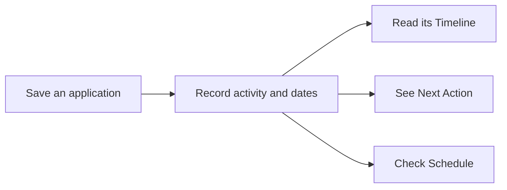

# How JobTracker works

JobTracker helps a job seeker answer three questions: **Where have I applied?
What has happened? What should I do next?** Applications and activity are saved
to the database and belong to the signed-in user.

## A typical session

1. Sign in with Clerk and open **Applications**.
2. Add a company and job title. Save a draft or choose the current hiring status.
3. Open the application to add notes, edit details or **Record activity**.
4. Use **Next Action** to see the suggested next step and **Schedule** to see dates.
5. Return to **Dashboard** for an overview of the job search.

Recording activity can also change the application status. For example, recording
an interview sets it to Interviewing. Suggestions themselves never change status.

## Pages

| Page | What it is for |
| --- | --- |
| Dashboard | Counts, active hiring processes, priority actions and a Schedule summary. |
| Applications | Add applications; search by company or job title; filter and sort. |
| Application Details | Read and edit the application, record activity, view Timeline or delete. |
| Schedule | Recorded deadlines and interviews, plus a separate Suggested attention section. |
| Insights | Current status distribution, progress beyond Applied and saved-data coverage. |
| Settings | Working light/dark theme controls; profile, tracking and export controls are previews. |

The desktop sidebar becomes a navigation drawer on smaller screens. The app opens
on Dashboard. Signing out hides the workspace and clears its cached application data.

## Adding and editing

Only **Company** and **Job title** are required. The shared Add/Edit form has five
sections:

| Section | Contents |
| --- | --- |
| Basic Info | Company, job title, job URL and location. |
| Application | Status, Applied date, Application due date, source and application method. |
| Contact | Contact person, email and follow-up preference; expandable. |
| Job Description | Saved advertisement text with Clean formatting and Undo. |
| More details | Salary range and personal notes; expandable. |

Contact and More details start collapsed when adding. Edit opens them when saved
values need to be shown. Collapsing a section preserves its fields.

Applied date appears for submitted or later statuses, or whenever it already has
a value. Changing status never inserts or clears that date. **Application due
date** is the deadline for sending the application, separate from interview,
assignment and offer dates.

Clean formatting removes trailing whitespace and excessive blank lines while
preserving wording, paragraphs, bullets and indentation. It affects only the
unsaved job description. Undo restores the previous text until another manual
description edit is made.

Saving persists changes through the API. If saving fails, the form keeps its
values and shows an error. Deletion requires confirmation and removes the
application and its Timeline events.

## Status, activity and next steps

The nine statuses are Draft, ToApply, Applied, Interviewing, Assignment, Offer,
Rejected, Ghosted and Withdrawn. Users can update status directly or record an
activity that moves the application to the corresponding stage.

**Timeline** shows saved facts: application creation and sending, status changes,
follow-ups, recruiter replies, interviews, assignments and offers. Ordinary notes
edits do not count as contact.

**Next Action** combines the current status with that history. Examples:

- A draft suggests finishing the application.
- An Applied application suggests waiting, following up or reviewing its status.
- A recorded future interview suggests preparing for it.
- A submitted assignment suggests waiting for feedback.
- Closed applications have no next action.

Follow-up is suggested after 14 days without newer contact only when a valid
contact email exists and the preference allows it. After 30 days, the suggestion
becomes **Review status**. The user decides whether to keep it active or mark it
as Ghosted; the app never marks it automatically.

See [workflow rules](application-workflow.md) for exact timing, stage changes and
date handling.

## Schedule and summaries

Schedule separates **hard dates** from **suggested attention**. Hard dates come
from application deadlines and recorded interview, assignment and offer dates.
They are grouped into overdue, today and upcoming. Follow-up and status-review
suggestions appear separately; they are not overdue commitments.

There is no separate reminder editor, completion action, snooze or background
notification service. Schedule is calculated from application data each time it
is rendered.

The Applications **Active** filter includes Draft and ToApply. Dashboard's
**Active hiring processes** counts only Applied, Interviewing, Assignment and
Offer. **Archived** is a filter for Rejected, Ghosted and Withdrawn, not a
separate archive operation.

Insights' **Response momentum** is the share of active hiring processes currently
in Interviewing, Assignment or Offer. It is a current-status summary, not a
historical response-rate measurement.

## Where the data lives

The deployed frontend runs on Vercel, the API on Railway and the database on Neon
PostgreSQL. Local development defaults to SQLite. The browser caches API responses;
reloading fetches persisted data again. Theme choice is stored in the browser.

The API validates Clerk sessions and limits every application query to the
current owner. Signing in never imports old demo data or another user's records.

For implementation details, see [architecture](architecture.md). For current
limitations and possible additions, see [roadmap](roadmap.md).
